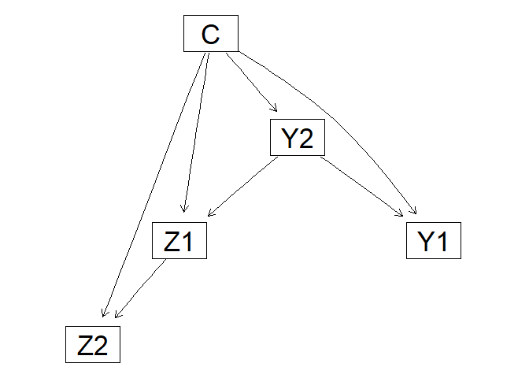

Structural learning of tree aumented naive Bayes using mixtures of
polynomials
================

This bundle contains the manuscript submitted to the Kybernetika and
entitled “*Structural learning of tree aumented naive Bayes using
mixtures of polynomial*”. The organisation is the following:

- fitTANGAUSS.R: R file where the code for learning conditional Gaussian
  TAN.
- example.R: A R file with a toy example for fit a conditional Gaussian
  TAN model.

The *fitTANGauss.R* file contains the `fit_tan_g`function. It computes
the structural and the parameters of a TAN models given a data.frame
considering the conditional Gaussian assumptions. In addition, this file
has the following auxiliary functions:

- `cond_mi_cont` and `cond_mi_cont_disc`. They compute the mutual
  information of two predicted variables given the class using
  conditional Gaussian assuptions.
- `MI_tan_gauss`. It computes the mutual information between each pair
  of feature variables given the class variable.
- `fit_root`. It computes a possible root for TAN model.
- `fit_tan_structure`.It computes the structure of a TAN model
  considering the conditional Gaussian assumptions given a mutual
  information matrix computed by `MI_tan_gauss`.

## Packages needed for running the code

The R packages needed for running the toy example could be downloaded
using Cran Repository. Using the following R commands to install the
packages:

``` r
# install.packages("bnlearn")
# install.packages("MASS")
# install.packages("infotheo")
```

## Data

The toy problem consists in a synthetic dataset with a class variable
*C*, two continuous features random variables and two discrete features
random variables following the conditional Gaussian assumptions. The
dataset contains 100 instances.

The following code load the toy problem dataset to the environment.

``` r
load("data.Rda")
```

## Computing conditional Gaussian TAN

First, we source the *fitTANGauss.R* file for load the neccessary
functions to compute the conditional Gaussian TAN model.

``` r
# Source fitTANGauss.R file
source("fitTANGauss.R")
```

Now, the conditional Gaussian TAN model can be computed using
`fit_tan_g`. This function requires *bnlearn* package for the parameter
learning.

``` r
# bnlearn R package is required for parameter learning process
library(bnlearn)
tan = fit_tan_g(target = "C",data = data)
tan
```

    ## 
    ##   Bayesian network parameters
    ## 
    ##   Parameters of node C (multinomial distribution)
    ## 
    ## Conditional probability table:
    ##     0    1 
    ## 0.61 0.39 
    ## 
    ##   Parameters of node Z1 (conditional Gaussian distribution)
    ## 
    ## Conditional density: Z1 | C + Y2
    ## Coefficients:
    ##                       0           1           2           3
    ## (Intercept)   0.5326947   0.5497585  -0.5878010  -0.6413849
    ## Standard deviation of the residuals:
    ##         0          1          2          3  
    ## 0.9508448  0.9166042  0.6780353  0.6617743  
    ## Discrete parents' configurations:
    ##    C  Y2
    ## 0  0   0
    ## 1  1   0
    ## 2  0   1
    ## 3  1   1
    ## 
    ##   Parameters of node Z2 (conditional Gaussian distribution)
    ## 
    ## Conditional density: Z2 | C + Z1
    ## Coefficients:
    ##                0    1
    ## (Intercept)  2.0  3.0
    ## Z1           0.9  0.8
    ## Standard deviation of the residuals:
    ##         0          1  
    ## 0.4395684  0.6080541  
    ## Discrete parents' configurations:
    ##    C
    ## 0  0
    ## 1  1
    ## 
    ##   Parameters of node Y1 (multinomial distribution)
    ## 
    ## Conditional probability table:
    ##  
    ## , , Y2 = 0
    ## 
    ##    C
    ## Y1          0         1
    ##   0 0.3125000 0.4285714
    ##   1 0.6875000 0.5714286
    ## 
    ## , , Y2 = 1
    ## 
    ##    C
    ## Y1          0         1
    ##   0 0.5862069 0.5555556
    ##   1 0.4137931 0.4444444
    ## 
    ## 
    ##   Parameters of node Y2 (multinomial distribution)
    ## 
    ## Conditional probability table:
    ##  
    ##    C
    ## Y2          0         1
    ##   0 0.5245902 0.5384615
    ##   1 0.4754098 0.4615385

``` r
# Plot the DAG using the graphviz.plot() from bnlearn package
graphviz.plot(tan)
```

    ## Loading required namespace: Rgraphviz

<!-- -->

### Choosing the root of TAN

The function `fit_tan_g` allows introduces the MI matrix and the root.
By default, the root is chosen as one of the feature variable with the
link with highest value in the MI matrix. If there are discrete and
continuous variables, the root is chosen considering only discrete
variables.

We can compute the conditional mutual information before TAN using
conditional Gaussian assumptions using `MI_tan_gauss`.

``` r
MI = MI_tan_gauss(data = data,target = "C")
MI
```

    ##            Z1        Z2         Y1         Y2
    ## Z1 0.00000000 0.7057450 0.07103087 0.22140686
    ## Z2 0.70574501 0.0000000 0.14934397 0.16443592
    ## Y1 0.07103087 0.1493440 0.00000000 0.02650156
    ## Y2 0.22140686 0.1644359 0.02650156 0.00000000

And, the TAN model using *Y1* as root is obtained with the following
code

``` r
# TAN with Y1 as root
tan2 = fit_tan_g(target = "C",data = data,root = "Y1",mutualInfoCond = MI)
graphviz.plot(tan2)
```

<!-- -->

``` r
# TAN model with illegal root
tan3 = fit_tan_g(target = "C",data = data,root = "Z1")
graphviz.plot(tan3)
```

<!-- -->

Finally, when there are only continuous feature variables.

``` r
# TAN model with only continuous feature variables
tan4 = fit_tan_g(target = "C",data = data[,c("C","Z1","Z2")],root = "Z1")
graphviz.plot(tan4)
```

<!-- -->

\`\`\`
